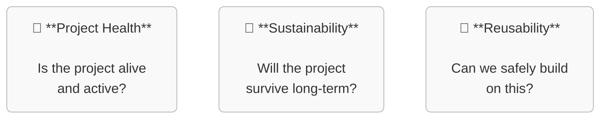

# 🚀 Health Analyzer PoC
> Reducing Risk in Open Source Adoption

## 🧭 Purpose
_The health-analyzer-poc is a **proof-of-concept** for evaluating the **health, sustainability, and reusability** of software projects hosted in Git repositories._
_The goal is to provide **data-driven insights** for stakeholders such as maintainers, contributors, and decision-makers._

## 🛤️ Three Ways to build and run the Health Analyzer PoC

The analyzer can be built to support two separate operational modes:

### 1. **Full-Stack**
- 📈 **Continuous monitoring** using selected [CHAOSS metrics](https://chaoss.community/kbtopic/all-metricsach with a persistent database backend.
- 🛠️ Requires infrastructure setup (e.g., storage, hosting) and ongoing maintenance.
- ✅ Suitable for long-term observability and trend analysis.

### 2. **Serverless BI**
- 📊 **Business insights without infrastructure** – reports are generated on-demand using automated workflows (e.g., GitHub Actions), with no servers to manage.
- 🔄 **Live data, reproducible results** – pulls fresh data from APIs like GitHub and transforms it into clear, shareable reports (Markdown or HTML).
- 🧠 **BI as code** – analytics are version-controlled, transparent, and embedded directly in your project repository.
- ⚡ **Fast, lightweight, and auditable** – ideal for evaluations where speed, traceability, and zero operational overhead are key.
- 🏅 **Standards-ready** – can be extended to support [OpenCode Badges](https://opencode.de/deorting.

### 3. **Hybrid-mode with added analytics **
- 📈 **Continuous monitoring** + 🧠 **BI as code** +  📊 **Business insights and analytics**
- 🏬 **Persistent database and Open Source analytics** (requires hosting and thus recurring hosting fees and an operations team)
- ♾️ **Point and Click based analytics** requires onboarding and training in Apache Superset

---

## 📦 Outputs

- 📄 **Health Reports** – Markdown/HTML summaries of key metrics.
- 🏷️ **Badges** – Optional visual indicators for embedding in READMEs in forges.
- 📊 **Dashboards** – (Full-stack mode only) Interactive views of project trends.
- 🔍 **Search and rating** – of software solutions across forges.

---

## 🛠️ Technology recommendations

- **APIs**
  - [GitHub API](https://docs.github.com/en/rest) – for retrieving repository data.
  - GitLab API – for interacting with GitLab-hosted repositories.
  - [Forgejo API](https://forgejo.org/docs/latesty data.

- **Metrics & Visualization**
  - CHAOSS metrics – for assessing open source community health.
  - [8knot](https://eightl for visualizing CHAOSS metrics.
  - [Evidence](https://github.com/e
    
## 🤝 Contributing

We welcome ideas, feedback, and suggestions!

If you’d like to contribute, please use the [Issue Tracker](https://github.com/OS2sandbox/health-analyzer-poc/issues) to:
- Suggest new metrics or features
- Share use cases or integration ideas
- Discuss ideas for implementations and code.
> 📝 You’ll need a **GitHub account** to create or comment on issues.

We’re especially interested in contributions that help make open source reuse safer and more transparent for non-technical stakeholders.
