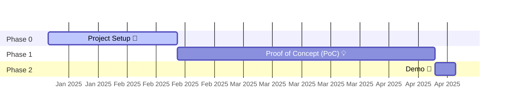

# 🚀 Project Health Analyzer
*A comprehensive toolkit for assessing the health, security, and vitality of software projects on GitHub.*

## 🎯 Purpose
Provide a repository-centric, modern and automated approach to evaluating software project quality and health through data-driven metrics.

## 🗺️ Roadmap

## 🚦 Getting Started

### Prerequisites
- GitHub API Token
- TBD
  
## 🤝 Contributing
Contributions welcome! `CONTRIBUTING.md` TBD

## 📄 License
TBD

## 🌟 Acknowledgements
- GitHub API
- OpenSSF Scorecard
