To run the all-in-one deployment:

```sh
mkdir -p .local/node_modules
echo $YOUR_GITHUB_TOKEN > .token
podman kube play deploy/pipeline.yaml
```

The app will be deployed on https://localhost:3000

Both aggregated data and raw data is available to the evidence.dev app, and can be used by manipulating `deploy/pages/index.md`. This way, a visual representation of the data can be created.  
Changes to this file will caused the app to update at run-time.

By default, the app will monitor the repository at `https://github.com/duckdb/duckdb-wasm`. The time required to fetch repository data will increase linearly with the amount of releases, contributors, commits, etc.  
To configure the collected information, change the values in `config/config.yaml`.

---

# GitHub Repository Metrics Collector

This project collects various metrics from GitHub repositories using the GitHub GraphQL API and outputs them as JSONL files. It's designed to help analyze repository activity, contributors, issues, and other key metrics.

## Features

- Collects information on markdown files at repository root (e.g. README.md, LICENSE.md)
- Retrieves repository license information
- Gathers list of releases, with timestamps
- Tracks contributors and their most recent contribution dates
- Collects commit history
- Records issue information including creators and status

## Prerequisites

- Python 3
- A GitHub personal access token with appropriate repository read permissions

## Installation

1. Clone the repository:
   ```bash
   git clone <repository-url>
   cd <repository-directory>
   ```

2. Install the required dependencies:
   ```bash
   pip install -r requirements.txt
   ```

## Configuration

The program can be configured using both a YAML configuration file and environment variables. Environment variables take precedence over the configuration file.

### Configuration File (config/config.yaml)

The default configuration file is located at `config/config.yaml`:

```yaml
repo:
  owner: "duckdb"           # Repository owner/organization
  name: "duckdb-wasm"       # Repository name

output:
  directory: "output"       # Output directory for JSONL files
  root_md_files: "root_md_files.jsonl"
  license: "license.jsonl"
  releases: "releases.jsonl"
  contributors: "contributors.jsonl"
  commits: "commits.jsonl"
  issues: "issues.jsonl"

github_api_url: "https://api.github.com/graphql"
pagination_limit: 100     # Number of items per API request
date_range_days: 365      # How far back to collect data (in days)
request_timeout: 30       # API request timeout in seconds
```

### Environment Variables

You can override configuration values using environment variables:

- `GITHUB_TOKEN`: (Required) Your GitHub personal access token
- `GITHUB_TOKEN_FILE`: (Alternative to `GITHUB_TOKEN`) Path to a file containing your GitHub personal access token
- `CONFIG_FILE`: Path to custom configuration file (optional)
- `REPO_OWNER`: Override repository owner from config
- `REPO_NAME`: Override repository name from config

Note: You must provide either `GITHUB_TOKEN` or `GITHUB_TOKEN_FILE`, but not both.

To create a GitHub personal access token:

1. Go to GitHub Settings > Developer settings > Personal access tokens
2. Generate a new token with repo scope
3. Copy the token for use with this application

To use a token file:
1. Create a file containing only your GitHub token (no extra characters or newlines)
2. Set the `GITHUB_TOKEN_FILE` environment variable to the path of this file

## Running the Program

### Running with Python

1. Set your GitHub token as an environment variable:
   ```bash
   export GITHUB_TOKEN=your_github_token_here
   ```
   
   OR set the path to a token file:
   ```bash
   export GITHUB_TOKEN_FILE=/path/to/your/token/file
   ```

2. Run the metrics collection script:
   ```bash
   python src/metrics_check.py
   ```

3. To use a custom configuration file:
   ```bash
   export CONFIG_FILE=path/to/your/config.yaml
   python src/metrics_check.py
   ```

4. To override repository owner/name:
   ```bash
   export REPO_OWNER=your_owner
   export REPO_NAME=your_repo
   python src/metrics_check.py
   ```

### Running with Docker

You can run the application using the pre-built Docker image:

1. Pull the image:
   ```bash
   docker pull codeberg.org/0xf1e/project-health-analyzer:latest
   ```

2. Run the container with your GitHub token:
   ```bash
   docker run --rm \
     -e GITHUB_TOKEN=your_github_token_here \
     -v $(pwd)/output:/app/output \
     codeberg.org/0xf1e/project-health-analyzer:latest
   ```

3. To use a token file:
   ```bash
   docker run --rm \
     -e GITHUB_TOKEN_FILE=/app/token.txt \
     -v /path/to/your/token/file:/app/token.txt \
     -v $(pwd)/output:/app/output \
     codeberg.org/0xf1e/project-health-analyzer:latest
   ```

4. To use a custom configuration file:
   ```bash
   docker run --rm \
     -e GITHUB_TOKEN=your_github_token_here \
     -v /path/to/your/config.yaml:/app/config/config.yaml \
     -v $(pwd)/output:/app/output \
     codeberg.org/0xf1e/project-health-analyzer:latest
   ```

5. To override repository owner/name:
   ```bash
   docker run --rm \
     -e GITHUB_TOKEN=your_github_token_here \
     -e REPO_OWNER=your_owner \
     -e REPO_NAME=your_repo \
     -v $(pwd)/output:/app/output \
     codeberg.org/0xf1e/project-health-analyzer:latest
   ```

## Output Files

All output files are saved in JSONL format (JSON Lines), with one JSON object per line. By default, files are saved to the `output/` directory.

### root_md_files.jsonl

Contains names of all markdown files in the repository root:

```json
{"file": "README.md"}
{"file": "CONTRIBUTING.md"}
```

### license.jsonl

Contains the repository license information:

```json
{"license": "MIT License"}
```

### releases.jsonl

Contains release information with timestamps:

```json
{"name": "v1.0.0", "publishedAt": "2023-01-15T10:30:00Z"}
```

### contributors.jsonl

Contains contributors with their most recent contribution date:

```json
{"login": "username", "last_contribution": "2023-05-20T14:22:30Z"}
```

### commits.jsonl

Contains commit information:

```json
{"message": "Fix bug in parser", "date": "2023-05-19T09:15:00Z", "author": "Developer Name"}
```

### issues.jsonl

Contains issue information:

```json
{"title": "Bug in authentication", "state": "CLOSED", "author": "user123", "createdAt": "2023-04-10T16:45:00Z"}
```

## Customization

You can modify the date range for data collection by changing the `date_range_days` value in the configuration. The default is 365 days (1 year).

The pagination limit can also be adjusted with `pagination_limit` to control how many items are fetched per API request.
---

# 🚀 Health Analyzer PoC
> Reducing Risk in Open Source Adoption

## 🧭 Purpose
_The health-analyzer-poc is a **proof-of-concept** for evaluating the **health, sustainability, and reusability** of software projects hosted in Git repositories._
_The goal is to provide **data-driven insights** for stakeholders such as maintainers, contributors, and decision-makers._

```mermaid
flowchart LR
  classDef card fill:#f9f9f9,stroke:#bbb,stroke-width:1px,color:#333,rx:6,ry:6

  H["🧠 **Project Health**<br><br>Is the project alive <br> and active?"]~~~
  S["🌱 **Sustainability** <br><br>Will the project <br> survive long-term?"]~~~
  R["🔁 **Reusability** <br><br>Can we safely build <br> on this?"]

  class H,S,R card
```


## 🛤️ Two Ways to build and run the Health Analyzer PoC

The analyzer can be built to support two separate operational modes:

### 1. **Full-Stack**
- 📈 **Continuous monitoring** using selected [CHAOSS metrics](https://chaoss.community/kbtopic/all-metricsach with a persistent database backend.
- 🛠️ Requires infrastructure setup (e.g., storage, hosting) and ongoing maintenance.
- ✅ Suitable for long-term observability and trend analysis.

### 2. **Serverless BI**
- 📊 **Business insights without infrastructure** – reports are generated on-demand using automated workflows (e.g., GitHub Actions), with no servers to manage.
- 🔄 **Live data, reproducible results** – pulls fresh data from APIs like GitHub and transforms it into clear, shareable reports (Markdown or HTML).
- 🧠 **BI as code** – analytics are version-controlled, transparent, and embedded directly in your project repository.
- ⚡ **Fast, lightweight, and auditable** – ideal for evaluations where speed, traceability, and zero operational overhead are key.
- 🏅 **Standards-ready** – can be extended to support [OpenCode Badges](https://opencode.de/deorting.


---

## 📦 Outputs

- 📄 **Health Reports** – Markdown/HTML summaries of key metrics.
- 🏷️ **Badges** – Optional visual indicators for embedding in READMEs in forges.
- 📊 **Dashboards** – (Full-stack mode only) Interactive views of project trends.
- 🔍 **Search and rating** – of software solutions across forges.

---

## 🛠️ Technology recommendations

- **APIs**
  - [GitHub API](https://docs.github.com/en/rest) – for retrieving repository data.
  - GitLab API – for interacting with GitLab-hosted repositories.
  - [Forgejo API](https://forgejo.org/docs/latesty data.

- **Metrics & Visualization**
  - CHAOSS metrics – for assessing open source community health.
  - [8knot](https://eightl for visualizing CHAOSS metrics.
  - [Evidence](https://github.com/e
    
## 🤝 Contributing

We welcome ideas, feedback, and suggestions!

If you’d like to contribute, please use the [Issue Tracker](https://github.com/OS2sandbox/health-analyzer-poc/issues) to:
- Suggest new metrics or features
- Share use cases or integration ideas
- Discuss ideas for implementations and code.
> 📝 You’ll need a **GitHub account** to create or comment on issues.

We’re especially interested in contributions that help make open source reuse safer and more transparent for non-technical stakeholders.
