# 🚀 Health Analyzer PoC
> Reducing Risk in Open Source Adoption

## 🧭 Purpose
_The health-analyzer-poc is a **proof-of-concept** for evaluating the **health, sustainability, and reusability** of software projects hosted in Git repositories._
_The goal is to provide **data-driven insights** for stakeholders such as maintainers, contributors, and decision-makers._

```mermaid
flowchart LR
  classDef card fill:#f9f9f9,stroke:#bbb,stroke-width:1px,color:#333,rx:6,ry:6

  H["🧠 Project Health<br><br>Is the project alive and active?<br>Track contributor activity, issue responsiveness, and release cadence to avoid dead or stagnant code."]~~~
  S["🌱 Sustainability<br><br>Will the project survive long-term?<br>Detect risks like abandonment, low bus factor, and missing governance to ensure continuity."]~~~
  R["🔁 Reusability<br><br>Can we safely build on this?<br>Assess documentation, modularity, and test coverage to support confident reuse."]

  class H,S,R card
```

## ⚙️ How It Works

The analyzer can be built to support two seperate operational modes:

### 1. **Full-Stack Mode**
- Leverages selected [CHAOSS metrics](https://chaoss.community/kbtopic/all-metricsa) and [8knot](https://eightknot.osci.io/chaoss) for **continuous monitoring** of repositories.
- Traditional "Dashboarding" approach with persistent database backend.
- ⚠️ Requires a larger infrastructure setup (e.g., persistent storage, dashboard hosting) and cost.

### 2. **Ephemeral Mode**
- Runs as a **containerized job** (e.g., via GitHub Actions or CI/CD pipelines).
- Pulls data from the **Forge (e.g. github API) API** and generates a **report** (Markdown or HTML).
- Ideal for **on-demand evaluations** with **zero infrastructure overhead**.
- Cold be built to be interoperable with [OpenCode Badges](https://opencode.de/de/software/badge-api-4058)
  
## 📦 Outputs
- **Health Reports**: Markdown/HTML summaries of key metrics.
- **Badges**: Optional visual indicators for embedding in READMEs in forges.
- **Dashboards**: (Full-stack mode only) Interactive views of project trends.
- **Search and rating** of software solutions across forges.

---

## 🛠️ Technologies Used
- [GitHub API](https://docs.github.com/en/rest) – for retrieving repository data.
- [GitLab API](https://docs.gitlab.com/api/rest/) – for interacting with GitLab-hosted repositories.
- [Forgejo API](https://forgejo.org/docs/latest/user/api-usage/) – for accessing Forgejo repository data.
- [CHAOSS metrics](https://chaoss.community/) – for assessing open source community health.
- [8knot](https://eightknot.osci.io/) – dashboard tool for visualizing CHAOSS metrics.
- [Kubernetes](https://kubernetes.io/) – for production setup of containerized workloads.
- Containerized development setup - [Podman](https://podman.io/) – daemonless, rootless container engine.
- CI/CD platforms:
  - [GitHub Actions](https://docs.github.com/en/actions) – automation for ephemeral mode.
  - [GitLab CI/CD](https://docs.gitlab.com/ci/) – pipelines for GitLab-hosted projects.
  - [Forgejo Runners](https://forgejo.org/docs/latest/admin/actions/runner-installation/) – self-hosted runners for Forgejo instances.
